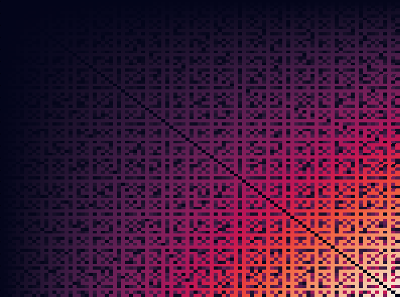

# Problem 1
Plot a sine wave. Plot another sine wave. Add them together!

```python
import numpy as np
import matplotlib.pyplot as plt

wave1 = np.sin(np.linspace(1,np.pi*2*2, 1000))
wave2 = np.sin(np.linspace(1,np.pi*2*4, 1000))
plt.plot(wave1)
plt.show()

plt.plot(wave1+wave2)
plt.show()

```

# Problem 1.75
Write some text to a file called `data.txt`. Specifically write out this text: 
```python
data = "The cup game is a classic problem in computer science that models work scheduling. In the cup game on n cups, a filler and an emptier take turns adding and removing water from cups (i.e. new tasks come in and the scheduler must allocate processors to handle the incoming work). On each round the filler will distribute some new amount of water among the cups, and the emptier will remove some amount of water from some of the cups. The filler can distribute the water however it wants (as long as it places at most 1 water in each cup), but the emptier has an added discretization constraint: it can only remove water from some fixed number of cups. The problem is to analyze how well each player can do, that is, how much water can the filler force to be in the fullest cup, and what is the upper bound on this fill that an appropriate emptying strategy can guarantee? We study several variants of the problem and answer some open questions."

with open("data.txt", "w") as f:
  f.write(data)
```
# Problem 1.5
Read in that file called `data.txt` and print it out
```python
with open("data.txt", "r") as f:
  print(f.read())
```

# Problem 2
Make a histogram of how many times each character occurs in that file
```python
import matplotlib.pyplot as plt

data = "blah bah blah"
plt.hist(list(data), bins=26)
plt.show()
```


# Problem 3
Generate some data of "happiness versus sleep".
It should be slightly random noise added to some distribution (e.g. `happiness = 1000-(sleep-7)**2 + np.random.random()`).

# Problem 4
Write that data out to a `csv` `happydata.csv`
Hint: use `import pandas`, or `import json`

# Problem 5
Read the data in from `happydata.csv`, and make a parabola of best fit (or whatever is appropriate based on your model). 
Hint: use `numpy`

# Problem 6
Make a heat map of `gcd(i,j)` $$i,j\in\{1,2,\ldots, n\}$$

```python
import matplotlib.pyplot as plt
import numpy as np

def gcd(n,m):
  n,m = max(m,n), min(m,n)
  if n % m == 0:
    return m
  return gcd(n%m, m)

def lcm(n,m):
  return (n*m) // gcd(n,m)

n=100
data = [[lcm(i,j) for i in range(1,n)] for j in range(1,n)]
plt.imshow(data)
plt.show()

# nicer plot with seaborn
import seaborn as sns
sns.heatmap(data, cbar=False)
plt.show()

```




# Problem 7
Make a graph of the primes.


